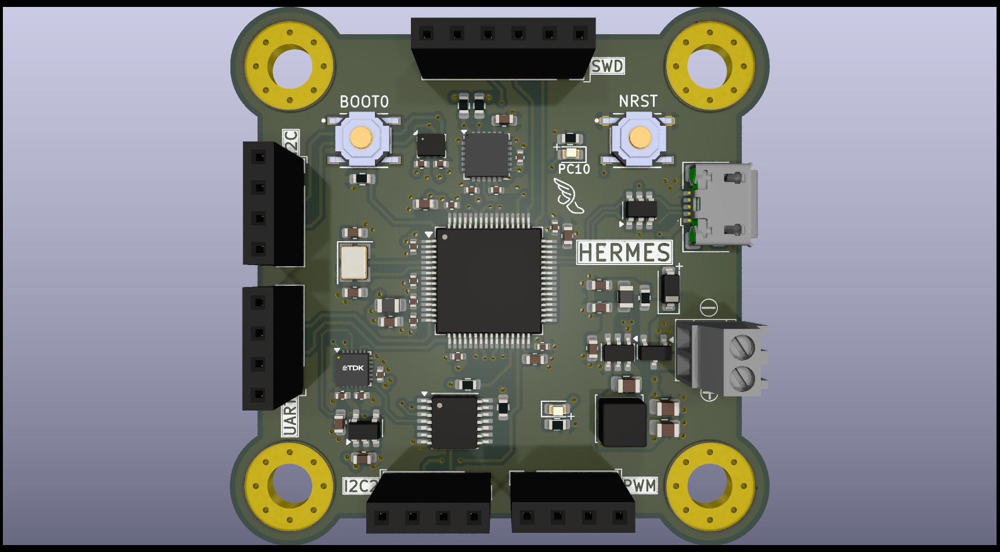
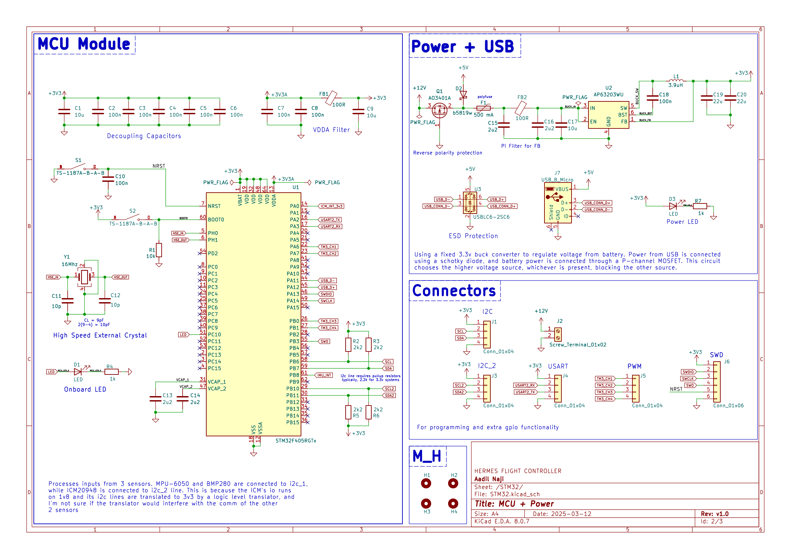

# **Hermes Flight Controller**

## **Overview**
This is a **custom STM32F405 based Flight Controller** designed for drone applications. The PCB is designed in **KiCad**.

Currently work-in-progress to build a working prototype.
Check back for updates.

## **Features**
- **Microcontroller:** STM32F405RGT6
- **IMU Sensor:** MPU-6050 / ICM-2098
- **Barometer:** BMP280
- **ESC Outputs:** 4x PWM channels
- **Communication Interfaces:** UART, I2C, USB

## **Hardware Design**
### **Schematic & PCB Layout**

## **License**
This project is open-source under the **MIT License**.

---
🚀 **Happy Flying!** 

